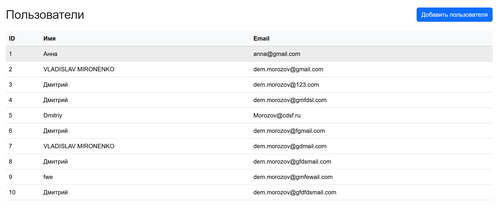
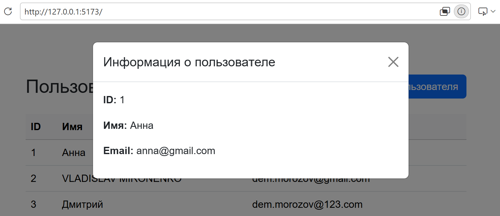
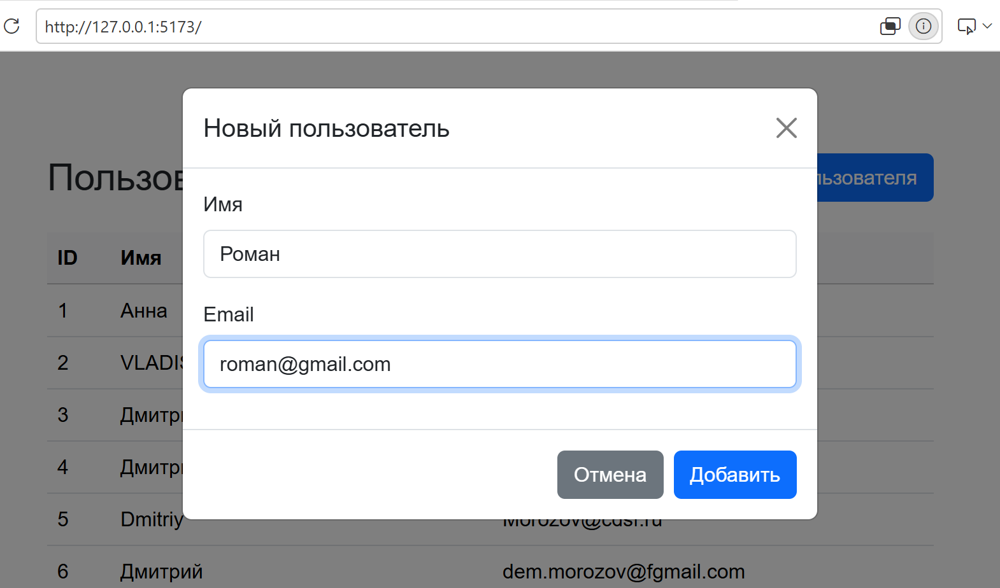
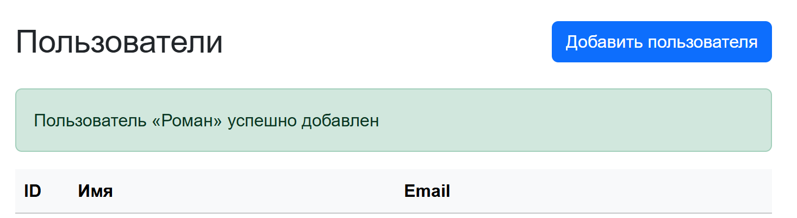
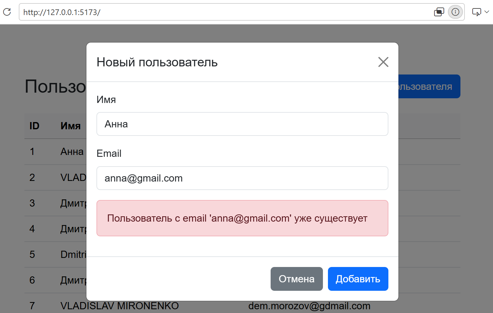

[](https://github.com/dm-morozov/user-management-flask/actions/workflows/web.yaml)
[](https://dm-morozov.github.io/user-management-flask/)
[](https://dem2014.pythonanywhere.com/)


# User Management Flask

Учебное fullstack-приложение для управления пользователями, выполненное в рамках Лаборатории практики Нетологии по заданию Digital-агентства «Победа».

Backend на Flask хранит пользователей в SQLite. Frontend использует Fetch API для работы с сервером и обновляет интерфейс без перезагрузки страницы.

## Демо

- [Frontend на GitHub Pages](https://dm-morozov.github.io/user-management-flask/)
- [Документация опубликованного API](https://dem2014.pythonanywhere.com/)
- [Список пользователей в JSON](https://dem2014.pythonanywhere.com/users)

Backend размещён на PythonAnywhere, frontend автоматически собирается и публикуется в GitHub Pages через GitHub Actions.

## Возможности

- Просмотр списка пользователей в таблице и подробной информации в модальном окне.
- Добавление пользователя через форму без перезагрузки страницы.
- Обновление таблицы, очистка и закрытие формы после успешного создания.
- Проверка обязательных полей и формата email средствами браузера.
- Серверная проверка непустых имени и email, обработка повторного email.
- Отображение состояний загрузки, пустого списка и ошибок.
- Уведомление об успехе с автоматическим скрытием через пять секунд.

## Стек

| Часть проекта | Технологии                                      |
| ------------- | ----------------------------------------------- |
| Backend       | Python, Flask, Flask-CORS                       |
| База данных   | SQLite, стандартный модуль `sqlite3` без ORM    |
| Frontend      | HTML, CSS, TypeScript, Fetch API                |
| Интерфейс     | Bootstrap 5                                     |
| Инструменты   | Vite, Yarn Classic, ESLint, TypeScript Compiler |
| Развёртывание | GitHub Actions, GitHub Pages, PythonAnywhere    |

Frontend написан без React и других UI-фреймворков: работа с DOM и событиями выполняется напрямую. TypeScript используется для типизации и при сборке преобразуется в JavaScript.

## Требования

- Python 3.14 — версия, использованная при локальной разработке; опубликованный backend работает на Python 3.13.
- Node.js 24.x — совместим с текущими зависимостями проекта.
- Yarn Classic 1.22.22.
- Git.

## Локальный запуск

Команды ниже приведены для PowerShell в Windows. Backend и frontend запускаются в двух отдельных терминалах из корня репозитория.

### 1. Получить проект

```powershell
git clone https://github.com/dm-morozov/user-management-flask.git
cd user-management-flask
```

### 2. Запустить backend

Создайте и активируйте виртуальное окружение, затем установите зависимости:

```powershell
python -m venv .venv
.\.venv\Scripts\Activate.ps1
python -m pip install -r backend\requirements.txt
```

Запустите Flask из корня проекта:

```powershell
python -m flask --app backend.app run --debug
```

API будет доступен по адресу `http://127.0.0.1:5000`.

Если PowerShell не разрешает запуск скрипта активации, можно использовать Python виртуального окружения напрямую, не меняя политику выполнения скриптов:

```powershell
.\.venv\Scripts\python.exe -m pip install -r backend\requirements.txt
.\.venv\Scripts\python.exe -m flask --app backend.app run --debug
```

При первом запуске автоматически создаются файл `backend/instance/users.db` и таблица `users`. Отдельный сервер базы данных не нужен. Начальная база пустая: первого пользователя можно добавить через интерфейс. Данные сохраняются между перезапусками приложения; готовая база со скриншотов не поставляется с репозиторием.

### 3. Запустить frontend

Во втором терминале установите зависимости и запустите Vite:

```powershell
yarn install --frozen-lockfile
yarn dev
```

Frontend будет доступен по адресу `http://127.0.0.1:5173`.

Backend должен продолжать работать в первом терминале. Для остановки каждого сервера нажмите `Ctrl+C` в соответствующем терминале.

### Первый пользователь

1. Нажмите «Добавить пользователя».
2. Введите имя и email, например `Анна` и `anna@example.com`.
3. Отправьте форму. Запись появится в таблице, а форма закроется.
4. Нажмите на строку таблицы, чтобы открыть подробную информацию.
5. Попробуйте повторно добавить тот же email — приложение покажет сообщение об ошибке.

## Скриншоты

### Список пользователей

Таблица с данными, загруженными из SQLite через API.



### Информация о пользователе

По клику на строку приложение запрашивает пользователя по ID и открывает модальное окно.



### Форма добавления

Ввод имени и email нового пользователя.



### Успешное создание

После успешного запроса форма очищается и закрывается, список обновляется, а над таблицей появляется уведомление.



### Ошибка повторного email

При попытке создать пользователя с занятым email форма остаётся открытой и показывает сообщение сервера.



## API

- Локальный адрес: `http://127.0.0.1:5000`.
- Опубликованный адрес: `https://dem2014.pythonanywhere.com`.

| Метод  | Endpoint      | Результат                                                                              |
| ------ | ------------- | -------------------------------------------------------------------------------------- |
| `GET`  | `/users`      | `200`: массив пользователей; для пустой базы — `[]`                                    |
| `GET`  | `/users/<id>` | `200`: пользователь; `404`: пользователь не найден                                     |
| `POST` | `/users`      | `201`: созданный пользователь; `400`: некорректные данные; `409`: email уже существует |

Пример тела запроса `POST /users` с заголовком `Content-Type: application/json`:

```json
{
  "name": "Анна",
  "email": "anna@example.com"
}
```

Пример успешного ответа со статусом `201 Created`:

```json
{
  "id": 1,
  "name": "Анна",
  "email": "anna@example.com"
}
```

Идентификатор назначается SQLite. Пробелы по краям имени и email удаляются на сервере.

Пример ответа при повторном email со статусом `409 Conflict`:

```json
{
  "error": {
    "code": "email_already_exists",
    "message": "Пользователь с email 'anna@example.com' уже существует"
  }
}
```

Поле `code` содержит технический код ошибки, а `message` — текст для пользователя.

## Структура проекта

```text
backend/
  app.py                    # Flask, HTTP-маршруты и обработка запросов
  database.py               # Соединения и транзакции SQLite
  user_repository.py        # SQL-запросы к таблице пользователей
  models.py                 # Тип данных пользователя
  schema.sql                # Схема базы данных
  templates/api-index.html  # Главная страница с документацией API
  requirements.txt          # Python-зависимости
.github/workflows/
  web.yaml                  # Проверка, сборка и публикация frontend
src/
  api/users-api.ts          # HTTP-запросы через Fetch API
  types/                   # Типы пользователей и ошибок API
  ui/                      # Таблица, форма, модальное окно и уведомления
  main.ts                  # Создание компонентов и связывание обработчиков
  styles.css               # Bootstrap и собственные стили
public/                    # Статические ресурсы
docs/screenshots/          # Скриншоты приложения
index.html                 # Статическая разметка страницы
vite.config.ts             # Настройки сервера разработки и сборки
.env.development           # Адрес локального API для Vite
.env.production            # Адрес опубликованного API для Vite
```

## Проверки и сборка

Проверка типов и линтер:

```powershell
yarn validate
```

Сборка frontend в каталог `dist/`:

```powershell
yarn build
```

Эти команды проверяют TypeScript, стиль кода и возможность сборки, но не заменяют проверку работы приложения в браузере.

### Ручная проверка

- Список загружается при открытии страницы.
- По клику отображаются подробности нужного пользователя.
- Новый пользователь добавляется без перезагрузки страницы.
- После успеха форма очищается и закрывается, уведомление исчезает через пять секунд.
- Повторный email вызывает понятную ошибку без очистки введённых данных.
- Пустые поля и некорректный формат email блокируются браузером.
- Закрытие модальных окон работает по крестику и клавише Escape.

## Развёртывание и конфигурация

- Vite получает адрес backend из `VITE_API_URL`: локальное значение хранится в `.env.development`, опубликованное — в `.env.production`.
- CORS разрешает обращения локального frontend и опубликованного сайта `https://dm-morozov.github.io`.
- Базовый путь production-сборки `/user-management-flask/` соответствует адресу проекта в GitHub Pages.
- GitHub Actions после каждого push в `main` устанавливает зависимости, проверяет TypeScript и ESLint, собирает frontend и публикует каталог `dist`.
- Backend работает на PythonAnywhere. Его SQLite-база создаётся и хранится отдельно от репозитория на сервере.
- Локальный Flask-сервер с `--debug` предназначен только для разработки.
- Приложение реализует просмотр и создание пользователей. Редактирование, удаление и авторизация не входят в текущую реализацию.
